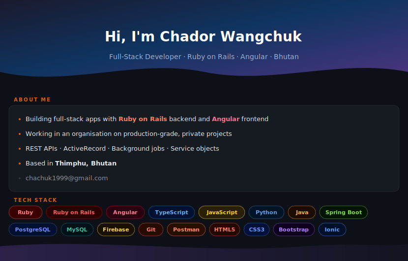

  

  

  
  &nbsp;
  

---

> 💡 **Private contributions:** Most of my work lives in private organisation repositories. To surface this activity in the stats below, go to **GitHub Settings → Profile** and enable **"Include private contributions on my profile"**.

---

## Stats

  
  &nbsp;
  

  

---

## Contribution Activity

  

---

## Trophies

  

---

## Connect

  
  &nbsp;
  
  &nbsp;
  

